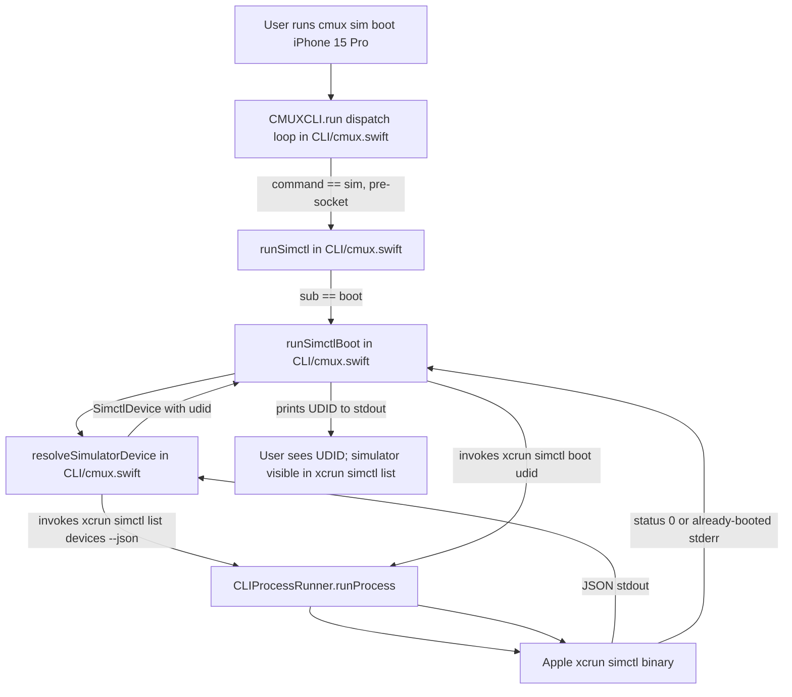
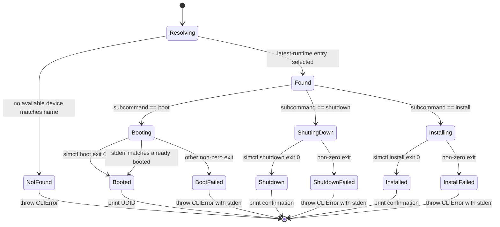

# Plan: Issue #1 — Spike 1: simctl wrapper CLI (sanity baseline)

**Generated:** 2026-04-26T00:00:00Z
**Contract version:** 2
**Context package:** [.memory/plans/1-context.md](./1-context.md)

## Summary
Add a `cmux sim` subcommand to the cmux CLI binary (`CLI/cmux.swift`) that lifecycles a named iOS Simulator by shelling out to `xcrun simctl`. The subcommand handles `list`, `boot`, `shutdown`, and `install`, runs locally without requiring a running cmux app, and produces the UDID needed by Spike #2 for framebuffer attach.

## Approach
1. Add the local pre-socket dispatch block `if command == "sim" { try runSimctl(commandArgs:); return }` in `CLI/cmux.swift` between the existing `feed` block (line ~1952) and the `setup-hooks` block (line ~1979). This matches the precedent for `opencode install-hooks`, `feed clear`, and `cursor install-hooks`, all of which run before `let client = SocketClient(...)` is constructed at line ~1984.
2. Implement `runSimctl(commandArgs: [String]) throws` as a private method on `CMUXCLI`, placed near the other agent-related helpers (e.g., immediately after `runFeedClear` at line ~16088). The function parses the first positional argument as the subcommand (`list` / `boot` / `shutdown` / `install` / `help` / `--help` / `-h`) and dispatches to small private helpers `runSimctlList`, `runSimctlBoot(deviceArg:)`, `runSimctlShutdown(deviceArg:)`, `runSimctlInstall(deviceArg:appPath:)`. Unknown subcommand → `CLIError(message: "Unknown sim subcommand: \(sub)")`.
3. Implement device resolution `resolveSimulatorDevice(nameOrUDID: String) throws -> SimctlDevice` that:
   - Fast-path: if the input is already a UDID (matches the regex `^[0-9A-F]{8}-([0-9A-F]{4}-){3}[0-9A-F]{12}$`, case-insensitive), return it without calling `simctl`.
   - Otherwise, call `xcrun simctl list devices --json`, JSON-decode the output with `JSONSerialization`, walk the `devices` map (keyed by runtime identifier like `com.apple.CoreSimulator.SimRuntime.iOS-18-2`), filter to entries where `isAvailable == true` AND `name == <input>`, then pick the device whose runtime key sorts last lexicographically (a stable tiebreaker that picks the latest iOS runtime; documented in the spike write-up).
   - If zero matches: `CLIError(message: "No available simulator named '\(name)'. Run 'cmux sim list' to see available devices.")`.
4. Implement `runSimctl(arguments: [String]) -> CLIProcessResult` as a thin wrapper around the existing `CLIProcessRunner.runProcess(executablePath: "/usr/bin/xcrun", arguments: ["simctl"] + arguments)`. No new helper module — ADR-0002 forbids new abstractions.
5. Handle `boot` idempotency: after invoking `simctl boot <udid>`, treat status 0 as success AND treat non-zero exits whose stderr matches `/already booted|state: Booted/i` as success. Print the UDID to stdout on success (the acceptance test asserts "returns a UDID").
6. Add a `case "sim":` block to `subcommandUsage(_:)` (around line ~7100, near `feed` / `opencode`) so `cmux sim --help` works without a running cmux. Help text is plain string literal (matches `feed`, `feedback`, `themes`, `opencode` precedent — those are not localized; `omo` / `omc` / `omx` localization is for tmux-shim helpers, not CLI subcommand help blocks).
7. Add a `sim <list|boot|shutdown|install> [device-name|udid] [app-path]` line to the top-level `usage()` output at `CLI/cmux.swift:17252`, placed near `markdown` and `browser` — peer surface CLIs.
8. Write `docs/spikes/01-simctl-wrapper.md` documenting: what shipped, what worked, the **headless-device limitation** (`simctl boot` boots through `CoreSimulatorService` and is not a true headless `SimDevice` — that's the limitation Spike #2 addresses), the device-name tiebreaker rule (latest runtime wins), the Xcode version tested, and the manual end-to-end verification command list.
9. Run `swift build` and verify it succeeds. Verify the unit-test target compiles via `xcodebuild -scheme cmux-unit ... build` if SPM doesn't catch CLI-target errors.

## Review findings addressed (PR #6)

- **Shutdown idempotency (SHOULD-FIX #1).** Mirrored the boot-side helper: added `simctlStderrIndicatesAlreadyShutdown(_:)` next to `simctlStderrIndicatesAlreadyBooted(_:)`. It matches `current state: Shutdown` case-sensitively (Apple emits "Shutdown" with a capital S in the canonical message `Unable to shutdown device in current state: Shutdown`) and `already shutdown` case-insensitively as a defensive variant. `runSimctlShutdown` now treats a non-zero exit whose stderr matches this helper as success, printing the standard `Shutdown <name> (<UDID>)` line. This eliminates the empirically reproduced exit 149 when shutting down an already-shutdown device.
- **Comment trim (SHOULD-FIX #2).** Reduced the `// MARK: - iOS Simulator wrapper` block in `CLI/cmux.swift` to keep only the architecturally non-obvious invariant ("Runs locally — does NOT route over the cmux Unix socket"). Removed the "Spike #1" reference, the "sanity baseline" framing, the "proves cmux can …" justification, and the spike write-up pointer, per CLAUDE.md comment policy.
- **Synthetic-device `isAvailable` annotation (NIT).** Added a one-line comment in `resolveSimulatorDevice` documenting that the synthetic `SimctlDevice` returned for unknown UDIDs sets `isAvailable: true` to mirror simctl's permissive UDID acceptance, not because availability is known.

## Constraints

- **ADR-0002** (Fork-then-upstream-PR): All code changes in `CLI/cmux.swift` ship to upstream. Match upstream conventions strictly:
  - Use the existing `CLIProcessRunner.runProcess` helper rather than introducing a new wrapper module.
  - Use `CLIError(message:)` for all user-facing errors (existing convention at `CLI/cmux.swift:14`).
  - Place the new dispatch block alongside the `feed` / `opencode install-hooks` peer pre-socket commands.
  - No private Apple SPI is touched in this spike — `xcrun simctl` is a public Apple CLI.
- **ADR-0003** (Graft workflow scaffold): `docs/spikes/01-simctl-wrapper.md` is workflow-scaffold and falls under the existing `docs/spikes/` directory cleanup rule in `scripts/upstream-pr-prep.sh` — no script change needed. The CLI changes in `CLI/cmux.swift` are NOT scaffold and ship to upstream untouched.
- **CLAUDE.md test quality policy**: Tests must verify observable runtime behavior, not source-text shape. For this CLI spike, choose **option (b): no new test file, manual verification only** — see "Test plan" rationale below.
- **CLAUDE.md never-run-tests-locally policy**: The agent runs `swift build` (PostToolUse hook command) and optionally `xcodebuild -scheme cmux-unit ... build` for compile verification. Full `xcodebuild ... test` is CI-only.

## File manifest

Files that will be **created**:
- `docs/spikes/01-simctl-wrapper.md` — Spike write-up: what worked, headless-device limitation motivating Spike #2, device-name tiebreaker rule, manual verification commands.

Files that will be **modified**:
- `CLI/cmux.swift` — Add `runSimctl` and supporting private methods (`runSimctlList`, `runSimctlBoot`, `runSimctlShutdown`, `runSimctlInstall`, `resolveSimulatorDevice`, `simctlListDevices`); add the `sim` pre-socket dispatch block; add `case "sim":` to `subcommandUsage`; add the `sim` line to `usage()`.

## Data model

```swift
/// Internal model used to project a device entry from `simctl list devices --json`.
/// Not persisted; only used during a single CLI invocation.
private struct SimctlDevice {
    let udid: String
    let name: String
    let state: String          // "Booted", "Shutdown", "Booting", "Shutting Down"
    let isAvailable: Bool
    let runtimeIdentifier: String
    let deviceTypeIdentifier: String?
}
```

The `simctl list devices --json` output is a JSON object of shape:
```jsonc
{
  "devices": {
    "com.apple.CoreSimulator.SimRuntime.iOS-18-2": [
      { "udid": "ABCDE...", "name": "iPhone 15 Pro", "state": "Shutdown", "isAvailable": true, "deviceTypeIdentifier": "..." }
    ],
    "com.apple.CoreSimulator.SimRuntime.iOS-17-5": [ ... ]
  }
}
```
We project this into `[SimctlDevice]` and apply the latest-runtime tiebreaker by sorting on `runtimeIdentifier` descending.

## System flow diagram



The diagram shows the path from the user's CLI invocation through the pre-socket dispatch in `CMUXCLI.run`, into the new `runSimctl` family of methods, which use the existing `CLIProcessRunner.runProcess` helper to shell out to `/usr/bin/xcrun simctl`. No socket connection is ever opened.

## State model / Data model diagram



The state machine shows the per-invocation lifecycle of `runSimctl`. Resolution is the first transition; subcommand-specific handlers then drive the simulator into the requested state, with the boot path explicitly accepting the "already booted" stderr as a success terminal.

## Acceptance criteria

- [ ] Tiny Swift CLI shells out to `simctl` for boot/shutdown/install of one named device.
- [ ] Exposes a `cmux sim ...` subcommand wired through cmux's existing CLI socket (`CLI/cmux.swift`).
- [ ] End-to-end manual test: `cmux sim boot 'iPhone 15 Pro'` returns a UDID and the simulator appears in `xcrun simctl list`.
- [ ] Spike write-up landed in `docs/spikes/01-simctl-wrapper.md` summarizing what worked and what limitations motivate Spike 2.
- [ ] All upstream cmux tests still pass (upstream's check command).

## Test plan

**Choice: option (b) — no new automated tests; rely on the documented manual end-to-end check from the acceptance criteria.**

Rationale (per CLAUDE.md test quality policy):
- The CLI subcommand's only meaningful behavioral surface is "shells out to `xcrun simctl` and propagates results." The internals are (a) JSON parsing of a stable Apple-defined schema and (b) `Process()` invocation. A unit test that mocks `CLIProcessRunner.runProcess` would either (i) re-test `JSONSerialization` (low value) or (ii) only verify dispatch-table shape (forbidden by CLAUDE.md test quality policy: "Do not add tests that only verify source code text, method signatures, AST fragments, or grep-style patterns").
- A real integration test would require an iOS Simulator runtime installed on the CI runner, which upstream cmux's CI does not provide. Adding one is out-of-scope for a Spike issue.
- Per CLAUDE.md: "If no meaningful behavioral or artifact-level test is practical, skip the fake regression test and state that explicitly." The spike write-up documents the manual verification path, which is also referenced from the acceptance criterion verbatim.

Per-criterion verification:
- **Tiny Swift CLI shells out to `simctl` for boot/shutdown/install of one named device.** → Code review of `CLI/cmux.swift` diff; manual run on the agent's macOS host.
- **Exposes a `cmux sim ...` subcommand wired through cmux's existing CLI socket (`CLI/cmux.swift`).** → Code review confirms the dispatch block is in `CLI/cmux.swift`. (Note: per gathering-notes interpretation (2), `sim` is added to the cmux CLI binary but does NOT route over the Unix socket — it runs locally, matching the precedent of `opencode install-hooks` / `feed clear`. See Open Questions.)
- **End-to-end manual test: `cmux sim boot 'iPhone 15 Pro'` returns a UDID and the simulator appears in `xcrun simctl list`.** → Documented as a copy-pasteable command sequence in `docs/spikes/01-simctl-wrapper.md`. Manually executed on the agent's host before declaring the implementation complete.
- **Spike write-up landed in `docs/spikes/01-simctl-wrapper.md` summarizing what worked and what limitations motivate Spike 2.** → File presence is verified by `self-check` against the file manifest.
- **All upstream cmux tests still pass (upstream's check command).** → CLAUDE.md mandates "Never run tests locally"; verified post-PR by GitHub Actions / VM. Locally the agent runs `swift build` (PostToolUse hook) and optionally `xcodebuild -scheme cmux-unit ... build` to confirm the unit-test target compiles.
- **Shutdown idempotency (PR #6 review).** → Manual: `cmux sim shutdown <device>` twice in a row, both exit 0. The second invocation is the regression case — without the fix it exits 149 with stderr `Unable to shutdown device in current state: Shutdown` (empirically reproduced by the orchestrator before the fix). The orchestrator re-runs this manually after the fix lands.

## Open questions

- **"Wired through cmux's existing CLI socket" interpretation.** The issue body's wording is ambiguous; per the context package's gathering notes, two readings exist:
  1. The `sim` command itself routes over the cmux Unix socket (would require a backend handler in `Sources/`).
  2. The `sim` subcommand is added to the `cmux` CLI binary (which happens to use a socket for OTHER commands), but `sim` itself runs locally.
  **This plan adopts reading (2)**, matching the precedent of `opencode install-hooks`, `feed clear`, `feedback`, and `setup-hooks`, which all run before the `SocketClient(...)` is constructed at `CLI/cmux.swift:1984`. Reading (2) is consistent with the acceptance criterion that `cmux sim boot ...` returns a UDID, which doesn't need cmux running. If a reviewer prefers reading (1), this is a follow-up issue (likely in M2 alongside the `Sources/SimulatorKit/` boundary) — not a blocker for the spike.
